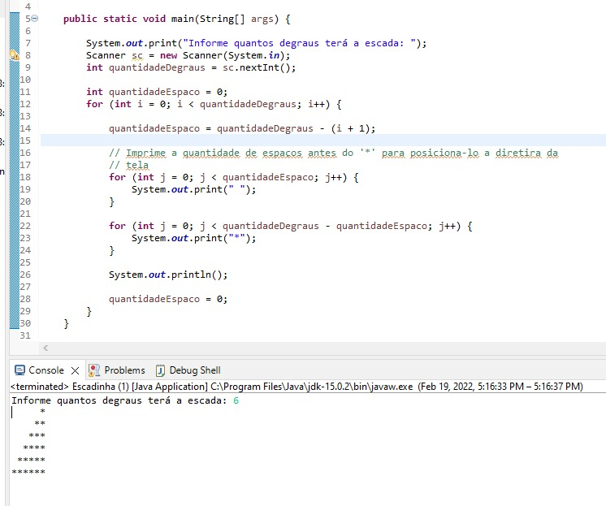
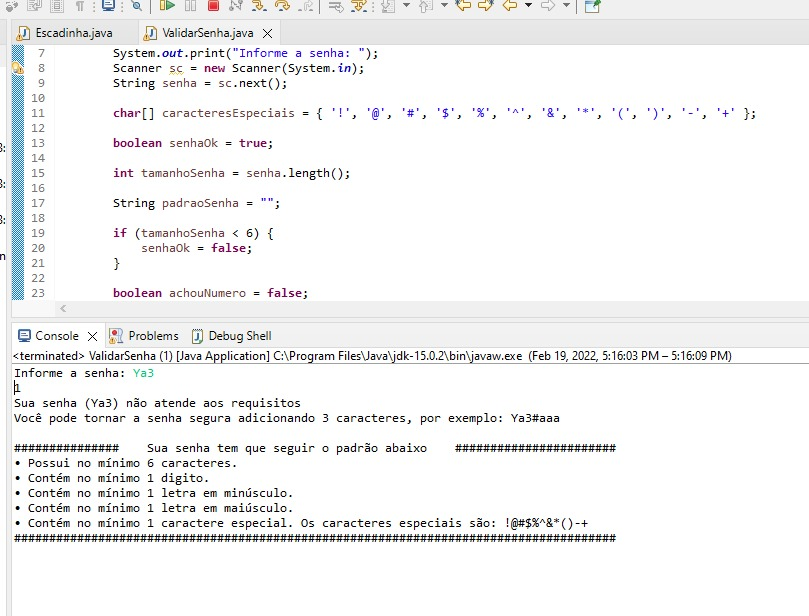

# DesafioCapgemini

Descrição do Projeto;

Questão 01.
O primeiro projeto imprime na tela uma escada convertendo o número digitado pelo usuário no caracter *.

  

Questão 02.
O segundo projeto tem como objetivo validar a senha digitada pelo usuário se a senha está nos critérios tais como; Possuir 6 caracteres; 
Conter letras,números e caracteres especiais.

  

Linguagem utilizada:

Java
